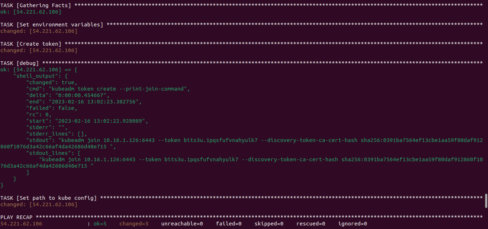
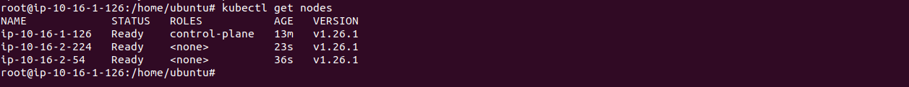

# Create a Kubernetes Cluster with kubeadm and terraform on AWS
This repo contains terraform and ansible code required to spin up resources required to run your own kubernetes cluster using kubeadm and CRI-O container runtime. All nodes run ubuntu OS and are of type t2.micro by default.

## Requirements
- terraform
- AWS CLI configured for a terraform user


## Procedure
1. Initiate terraform
   ```bash
   terraform init
   ```

2. Make a Plan to view resources being provisioned
   ```bash
   terraform plan
   ```

3. Provision planned infrastructure (`-auto-approve` executes the command in non-interactive mode)
   ```bash
   terraform apply -auto-approve
   ```
   Terraform will write files containing the node ssh key and all the IPs of the nodes both public and private. You'll find them in the ansible folder

4. Run the playbook for the master node. Initialize kubeadm.
  ```bash
  cd ansible
  ansible-playbook -i hosts/kube-cluster-master-host master-playbook.yaml --private-key kube-cluster-key -u ubuntu
  ```
  Copy the `$MASTER_PRIVATE_IP`, `$TOKEN` and `$HASH` from the result of the ansible playbook. (Do not include the <:port> for the master_private_ip)
  

5. Run the playbook to connect the worker nodes to the master node. Set the copied variables and pass them to the command below.
  ```bash
  cd ansible
  ansible-playbook -i hosts/kube-cluster-worker-host worker-playbook.yaml -e MASTER_PRIVATE_IP=10.16.1.126 -e TOKEN=bits3u.1pqsfufvnahyulk7 -e HASH=sha256:0391ba7564ef13cbe1aa59f80daf912860f1076d3a42c66af4da42686d48e715 --private-key kube-cluster-key -u ubuntu
  ```
  Make sure to replace the variables in the above command with the copied results from step 4.

6. SSH into the master node and check if the nodes are up
  ```bash
  cd ansible
  ssh -i kube-cluster-key ubuntu@<MASTER_PUBLIC_IP>
  kubectl get nodes
  ```
  Result after connecting worker nodes 
  
